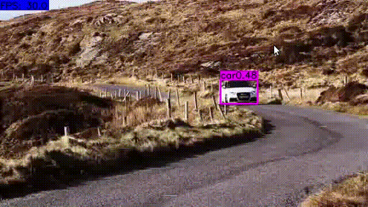

# RealTimeTrackDet

This repository implements [CenterNet]() and [SiamMask]() projects in a demo to perform Real Time Tacking and Detection on videos.

## Dependencies

This code uses Pytorch 1.2 so, proper NVIDIA drivers and CUDA 10 must be installed.

## Install

```
# Clone Repository
git clone https://github.com/AlbertoSabater/RealTimeTrackDet
cd RealTimeTrackDet
export RTTD=$PWD

# Create conda environment
conda create --name rttd python=3.6
conda activate rttd
pip install -r requirements.txt

# Install SiamMask and download weights
cd $RTTD/SiamMask/
sh make.sh
cd $RTTD/SiamMask/experiments/siammask_sharp
wget http://www.robots.ox.ac.uk/~qwang/SiamMask_DAVIS.pth

# Install CenterNet
cd $RTTD/CenterNet/src/lib/models_center_net/networks/DCNv2
./make.sh
```

Download CenterNet weights and store them in `$RTTD/CenterNet/models/`

## Test

The script will start by default performing Detection on the selected video.
Press _R_ to change to Tracking mode. To initialize tracking, select ROI with the mouse and press _Space/Enter_.
Change to Detection mode by pressing _R_ again.
Press _Q_ to exit execution.

`python demo.py video_1.mp4`


